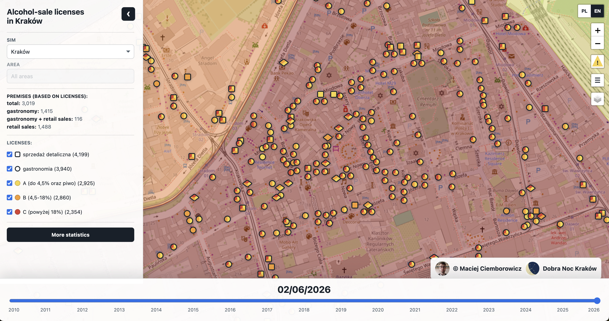

# Alcohol licenses in Kraków

[](https://dobra-noc-krakow.pl/alkomapa/)

## About

This repository processes Kraków alcohol-license reports into normalized
locations, geocoding provenance, analytical sales points, and an open dataset
release prepared for Zenodo.

## Dataset

The versioned open-data package is available on Zenodo:
[https://zenodo.org/records/21895077](https://zenodo.org/records/21895077).
It contains the publication-ready CSV and GeoJSON files, including license
records, raw and normalized locations, sales points, license-to-point
memberships, geocoding and review audit tables, SIM-unit boundaries,
population snapshots, city/district/SIM aggregates, and source metadata.

## Prerequisites

* Ruby 3.1.2, matching `Gemfile` and `.ruby-version`.
* Bundler.
* SQLite, used by the Rails application database.
* Python with the dependencies from `vendor/extractor/Pipfile` only when
  regenerating CSV tables from downloaded PDFs.
* Java only when using the PDF extractor, because `tabula-py` depends on Tabula.
* Node/npm only when regenerating Mermaid documentation diagrams.

## Setup

Make sure the active Ruby version is 3.1.2 before running Rails commands:

```sh
ruby -v
```

```sh
bin/setup
```

For an already configured checkout, the database can also be prepared directly:

```sh
bin/rails db:setup
```

## Source Data

The processing database is built from two license-report source streams:

* `vendor/data/xlsx/*.xls*` - historical XLS/XLSX reports obtained from the
  municipal office.
* `vendor/data/files/**/*.pdf` - official BIP PDF publications downloaded by
  the crawler in `vendor/crawler`.

PDF files are converted to CSV by the extractor in `vendor/extractor`; the
importer reads those extracted tables from `vendor/data/files/output/*.csv`.
The source selector imports all available spreadsheets and then uses
PDF-derived CSV reports only after the seven-day cutoff following the last
spreadsheet report date.

Additional local inputs include `vendor/data/simc_streets.csv` for the street
dictionary and the SIM population source files used by `sim:import_population`.
The curated interpretation layer is versioned in `db/curation/current.json`.

## Research Pipeline

The current open-data pipeline is:

```sh
bin/rails research:import_sources
bin/rails research:normalize_locations
bin/rails research:geocode_open
bin/rails research:geocode_google_quality_control  # optional
bin/rails research:rebuild_analysis
bin/rails research:write_grouping_audit
bin/rails research:release_dataset
bin/rails research:prepare_zenodo_repository
```

Full open-data pipeline, without Google quality-control geocoding:

```sh
bin/rails research:full_open_pipeline
```

Curated corrections and review decisions are versioned in
`db/curation/current.json`. This snapshot protects manual address fixes,
selected geocoding decisions, and geocoding review outcomes without storing the
local SQLite database or raw geocoder responses in git.

## Task Reference

The `research:*` tasks above are the preferred entrypoints. Lower-level tasks
remain available for partial rebuilds and debugging:

```sh
bin/rails source_data:import_license_reports
bin/rails streets:import_simc
bin/rails sim:import_population
bin/rails locations:normalize
bin/rails geocoding:krakow_msip_address_points
bin/rails geocoding:gus_address_points
bin/rails geocoding:uldk_parcels
bin/rails geocoding:osm_missing_locations
bin/rails geocoding:sync_osm_locations
bin/rails geocoding:google
bin/rails license_point_groups:rebuild ALL=1
bin/rails grouping_audit:write
bin/rails dataset:release
bin/rails dataset:prepare_publication_repo
```

`geocoding:google` is optional and requires `GOOGLE_MAPS_API_KEY`. Google
responses are used only for quality control and are not redistributed in the
public dataset.

## Documentation

Stable generated documentation is kept in `docs/`:

* `docs/erd.pdf` - current Rails model ERD.
* `docs/point_grouping_flowchart.mmd` and
  `docs/point_grouping_flowchart.svg` - dataset processing flow.
* `docs/deployment.md` - production deployment assumptions and workflow.

Working notes, one-off audits, and generated review checklists should go under
`tmp/`, not `docs/`.
